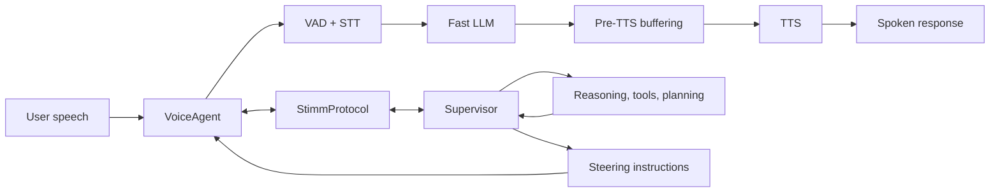

<div align="center">
  
  <p>
    <b>Optimistic VUI. One agent talks fast, one agent thinks deep, both collaborate in real-time.</b>
  </p>

  <a href="https://github.com/stimm-ai/stimm/actions">
    
  </a>
  <a href="https://github.com/stimm-ai/stimm/blob/main/LICENSE">
    
  </a>
  <a href="#">
    
  </a>
  <a href="#">
    
  </a>
  <a href="https://stimm-ai.github.io/stimm/">
    
  </a>
  <a href="#">
    
  </a>
  <a href="#">
    
  </a>
</div>

Stimm is an Optimistic VUI runtime built on [livekit-agents](https://github.com/livekit/agents).
It brings optimistic UI thinking to voice: acknowledge early, speak early, and
keep reasoning in parallel.

Use it when you want a voice agent that feels immediate without giving up tool
use, planning, or deeper supervision.

## Why Stimm

- Optimistic VUI for speech-first products: fast acknowledgement, progressive response, safe supervisor steering.
- Low-latency conversational loop (`VAD -> STT -> fast LLM -> TTS`).
- Dual-agent runtime: one agent handles the live turn, one agent reasons in the background.
- Typed protocol for Python and TypeScript supervisors.
- Runtime-safe provider contract and generated provider catalog from LiveKit docs.
- Wizard-first onboarding flow: discover providers first, install extras second.

## What Is Optimistic VUI?

Optimistic VUI is the voice equivalent of optimistic UI.

Instead of making the user wait for the entire reasoning chain to complete,
the system starts behaving usefully as soon as it has enough confidence to move
the conversation forward.

- Acknowledge the user immediately.
- Start speaking as early as possible.
- Keep the response interruptible and steerable.
- Let deeper reasoning continue in parallel.

That is the core idea behind Stimm: one agent talks fast, one agent thinks
deep.

## Use Cases

- Customer support voice agents that must answer quickly while deeper retrieval or tool calls continue in the background.
- Phone and SIP assistants that need to feel responsive before business logic fully resolves.
- Realtime copilots where speech should start early, but supervision, correction, and orchestration still matter.
- Embedded or kiosk voice experiences where perceived latency is more important than raw model latency.

## Architecture


```mermaid
flowchart LR
    U[User speech] --> V[VoiceAgent]
    V --> P1[VAD + STT]
    P1 --> F[Fast LLM]
    F --> B[Pre-TTS buffering]
    B --> T[TTS]
    T --> A[Spoken response]

    V <--> C[StimmProtocol]
    C <--> S[Supervisor]
    S --> R[Reasoning, tools, planning]
    R --> S
    S --> I[Steering instructions]
    I --> V
```

The `VoiceAgent` owns the live turn. The `Supervisor` watches the transcript,
reasons asynchronously, and can steer the conversation without blocking the
first response.

## Install

```bash
# 1) Core package only
pip install stimm

# 2) Install only the providers you selected
pip install stimm[deepgram,openai]

# Optional: install all runtime-supported providers
pip install stimm[all]

# TypeScript supervisor client
npm install @stimm/protocol
```

Plugin dependencies are installed in the integrator app environment. Stimm does
not vendor provider plugin code inside its wheel.

## Quick Start

### Voice Agent (Python)

```python
from stimm import VoiceAgent
from livekit.plugins import deepgram, openai, silero

agent = VoiceAgent(
    stt=deepgram.STT(),
    tts=openai.TTS(),
    vad=silero.VAD.load(),
    fast_llm=openai.LLM(model="gpt-4o-mini"),
    buffering_level="MEDIUM",
    mode="hybrid",
    instructions="You are a helpful voice assistant.",
)

if __name__ == "__main__":
    from livekit.agents import WorkerOptions, cli

    cli.run_app(WorkerOptions(entrypoint_fnc=agent.entrypoint))
```

### Supervisor (Python)

```python
from stimm import Supervisor, TranscriptMessage


class MySupervisor(Supervisor):
    async def on_transcript(self, msg: TranscriptMessage):
        if not msg.partial:
            result = await my_big_llm.process(msg.text)
            await self.instruct(result.text, speak=True)
```

### Supervisor (TypeScript)

```typescript
import { StimmSupervisorClient } from "@stimm/protocol";

const client = new StimmSupervisorClient({
  livekitUrl: "ws://localhost:7880",
  token: supervisorToken,
});

client.on("transcript", async (msg) => {
  if (!msg.partial) {
    const result = await myAgent.process(msg.text);
    await client.instruct({ text: result, speak: true, priority: "normal" });
  }
});

await client.connect();
```

## Wizard-First Provider Flow

For onboarding UIs, use the catalog API to display providers and parameters,
then derive extras from the user selection:

```python
from stimm import extras_install_command, get_provider_catalog

catalog = get_provider_catalog()
cmd = extras_install_command(stt="deepgram", tts="openai", llm="azure-openai")
print(cmd)  # pip install stimm[deepgram,openai]
```

After extras installation, restart the Python process before instantiating
LiveKit plugin classes.

## Dual-Agent Architecture

Stimm is fundamentally built around two cooperating agents:

- `VoiceAgent`: optimized for low-latency spoken interaction.
- `Supervisor`: optimized for deeper reasoning, planning, and tool orchestration.

They exchange typed protocol messages over LiveKit data channels, allowing fast
turn-by-turn response while retaining high-level control and context.

| Component | Role |
|---|---|
| `VoiceAgent` | Handles live turn-by-turn speech interaction |
| `Supervisor` | Watches transcript and steers behavior asynchronously |
| `StimmProtocol` | Structured messages over LiveKit data channels |

## Runtime Modes

- `autonomous`: the voice agent acts independently.
- `relay`: the voice agent only speaks supervisor instructions.
- `hybrid` (default): autonomous first response with supervisor steering.

## Pre-TTS Buffering

- `NONE`: send tokens immediately.
- `LOW`: buffer until word completion.
- `MEDIUM` (default): buffer until 4 words or punctuation.
- `HIGH`: buffer until punctuation.

These levels let you choose where to sit between raw latency and cleaner spoken
delivery.

## Developer Workflow

```bash
# Install dev dependencies
pip install -e ".[dev]"

# Local infra
docker compose up -d

# Build local artifacts + sync providers + validate runtime contract
bash scripts/dev_build.sh

# Tests / lint
pytest
ruff check src/ tests/

# Catalog/contract checks (CI-equivalent)
python3 scripts/sync_livekit_plugins.py --check
python3 scripts/validate_runtime_contract.py --import-check
```

`scripts/dev_build.sh` is the single local command to rebuild protocol artifacts
and provider metadata from the LiveKit source of truth.

## Documentation

- Docs site source: [website](website)
- Getting started overview: [website/docs/getting-started/overview.md](website/docs/getting-started/overview.md)
- Quick start: [website/docs/getting-started/quickstart.md](website/docs/getting-started/quickstart.md)
- Provider catalog reference: [website/docs/reference/providers-catalog.md](website/docs/reference/providers-catalog.md)
- Wizard integration: [website/docs/integrations/wizard.md](website/docs/integrations/wizard.md)
- Supervisor observability: [website/docs/integrations/supervisor-observability.md](website/docs/integrations/supervisor-observability.md)

## License

MIT