<div align="center">
  
  <p>
    <b>The Open Source Voice Agent Platform</b><br>
    Orchestrate ultra-low latency AI pipelines for real-time conversations over WebRTC.
  </p>

  <a href="https://github.com/stimm-ai/stimm/actions">
    
  </a>
  <a href="https://github.com/stimm-ai/stimm/blob/main/LICENSE">
    
  </a>
  <a href="#">
    
  </a>
  <a href="#">
    
  </a>
  <a href="https://stimm-ai.github.io/stimm/">
    
  </a>
  <a href="#">
    
  </a>
  <a href="#">
    
  </a>
  <a href="#">
    
  </a>
  <a href="#">
    
  </a>
  <a href="#">
    
  </a>
  <div align="center">
    <video src="https://github.com/user-attachments/assets/a87909f2-0f44-45ba-9a27-c4f233805da8" width="100%" controls="controls" muted="muted" autoplay="autoplay">
    </video>
    <p><i>🔊 Sound on! Watch the ultra-low latency (< 1s) in action.</i></p>
  </div>
</div>
<br>

A modular, real-time AI voice assistant platform built with Python (FastAPI) and Next.js. This project provides a flexible infrastructure for creating, managing, and interacting with voice agents using various LLM, TTS, and STT providers.

📚 **[Read the Full Documentation](https://stimm-ai.github.io/stimm/)**

#### [Features](#-features) · [Why Stimm?](#-why-stimm) · [Use Cases](#-use-cases) · [How it Works](#-how-it-works) · [Quick Start](#-quick-start) · [Docs](https://stimm-ai.github.io/stimm/)

## 🚀 Features

- **Real-time Voice Interaction**: Low-latency voice conversations using WebRTC and WebSocket transports.
- **SIP Telephony Integration**: Connect incoming phone calls to AI agents via SIP protocol.
- **Modular AI Providers**:
  - **LLM**: Support for Groq, Mistral, OpenRouter, and local Llama.cpp.
  - **TTS**: Deepgram, ElevenLabs, Async.ai, and local Kokoro.
  - **STT**: Deepgram and local Whisper.
- **Administrable RAG Configurations**: Create and manage multiple RAG configurations with Qdrant and per‑agent knowledge bases.
- **Agent Management**: Admin interface to configure and manage multiple agents with different personalities and provider settings.
- **Modern Frontend**: Responsive web interface built with Next.js 16 and Tailwind CSS.
- **Robust Infrastructure**: Dockerized deployment with Traefik reverse proxy, PostgreSQL for data persistence, and Alembic for migrations.
- **Voice Activity Detection**: Integrated Silero VAD for accurate speech detection.

## 💡 Why Stimm?

- **Ultra-low latency** thanks to optimized Silero VAD and LiveKit real-time media pipeline.
- **Provider-agnostic** (LLM, TTS, STT): choose any AI stack.
- **Scalable architecture**: Docker, Traefik, Postgres, and a technical foundation designed for production deployment.

## 🧩 Use Cases

- **Customer support voicebots**: Handle common queries automatically.
- **Interactive phone-based assistants (SIP)**: Connect traditional telephony to AI.
- **Real-time agent demos**: Perfect for AI research and prototyping.
- **On-premise conversational agents**: Deploy securely with AGPL-friendly terms.

## 🔄 How it Works

```mermaid
graph LR
    %% High Contrast Theme
    classDef person fill:#FF007F,stroke:#fff,stroke-width:4px,color:white,font-weight:bold;
    classDef transport fill:#00B0FF,stroke:#fff,stroke-width:2px,color:white,font-weight:bold;
    classDef input fill:#7F00FF,stroke:#fff,stroke-width:2px,color:white,font-weight:bold;
    classDef brain fill:#FFD700,stroke:#FF8C00,stroke-width:3px,color:black,font-weight:bold,stroke-dasharray: 5 5;
    classDef output fill:#00E676,stroke:#fff,stroke-width:2px,color:black,font-weight:bold;
    
    %% Multi-platform User
    User([👤 📱 💻 📞 User]):::person

    %% LiveKit Layer
    subgraph "📡 LiveKit Infrastructure"
        direction TB
        Room[🔄 Real-time Room <br/> WebRTC / SIP]:::transport
    end

    %% Stimm Core Layer
    subgraph "⚡ Stimm Core"
        direction TB
        Hear[👂 Hear & Transcribe]:::input
        Think(🧠 Think & Retrieve):::brain
        Speak[🗣️ Speak & Respond]:::output
    end

    %% Connections
    User <==>|Audio Stream| Room
    Room ==>|Raw Audio| Hear
    Hear ==>|Text| Think
    Think ==>|Text| Speak
    Speak ==>|Synthesized Audio| Room
    
    %% Link Styles
    linkStyle default stroke-width:3px,fill:none,stroke:#666
```



## 🏁 Quick Start

Get Stimm up and running in minutes:

```bash
# Clone the repository
git clone https://github.com/stimm-ai/stimm.git
cd stimm

# Set up environment (copies .env.example files)
chmod +x scripts/setup_env.sh
./scripts/setup_env.sh

# Start all services with Docker Compose
docker-compose up --build
```

Once the services are running, open your browser to:

- **Frontend Admin**: http://front.localhost/agent/admin (or http://localhost:3000/agent/admin)
- **API Documentation**: http://api.localhost/docs (or http://localhost:8001/docs)

For detailed instructions, refer to the [Full Documentation](https://stimm-ai.github.io/stimm/) or check the guides below:

- [**Configuration**](https://stimm-ai.github.io/stimm/user-guide/configuration/): Configure providers (LLM, TTS, STT).
- [**Web Interface**](https://stimm-ai.github.io/stimm/user-guide/web-interface/): Manage agents and RAG via the UI.
- [**SIP Integration**](https://stimm-ai.github.io/stimm/user-guide/sip-integration/): Connect phone numbers to your agents.
- [**Development**](https://stimm-ai.github.io/stimm/developer-guide/development/): Setup local environment.

## 💻 Development

For local development, see the [Development Guide](https://stimm-ai.github.io/stimm/developer-guide/development/) in the documentation.

### Quick Development Setup

```bash
# Start supporting services (PostgreSQL, Qdrant, LiveKit, Redis, SIP)
docker compose up -d postgres qdrant traefik livekit redis sip

# Install Python dependencies
uv sync --group dev --group docs

# Set up environment files and Python path (optional)
./scripts/setup_env.sh

# Run backend locally
uv run python -m src.main

# In another terminal, run frontend
cd src/front
npm install
npm run dev
```

## 🤝 Contributing

We welcome contributions! Please read our [Contributing Guide](https://stimm-ai.github.io/stimm/project/contributing/) for details on how to submit pull requests, report issues, and our code of conduct.

By contributing, you agree to the [Contributor License Agreement (CLA)](https://stimm-ai.github.io/stimm/project/contributing/#contributor-license-agreement-cla).

## ⚖️ License

Stimm is open-source software licensed under the **GNU Affero General Public License v3.0 (AGPL v3)**. See the [LICENSE](LICENSE) file for details.

**Trademark Notice**: The name "Stimm" and the Stimm logo are exclusive trademarks of the project maintainers and are not covered by the open-source license. Derivative works must remove the logo and change the name to avoid suggesting official affiliation.

## ⚡ Acknowledgments

**Built with LiveKit**

Stimm relies on [LiveKit](https://livekit.io/) for high-performance real-time media transport (WebRTC).

*Disclaimer: Stimm is an independent project and is not affiliated with, endorsed by, or sponsored by LiveKit.*
