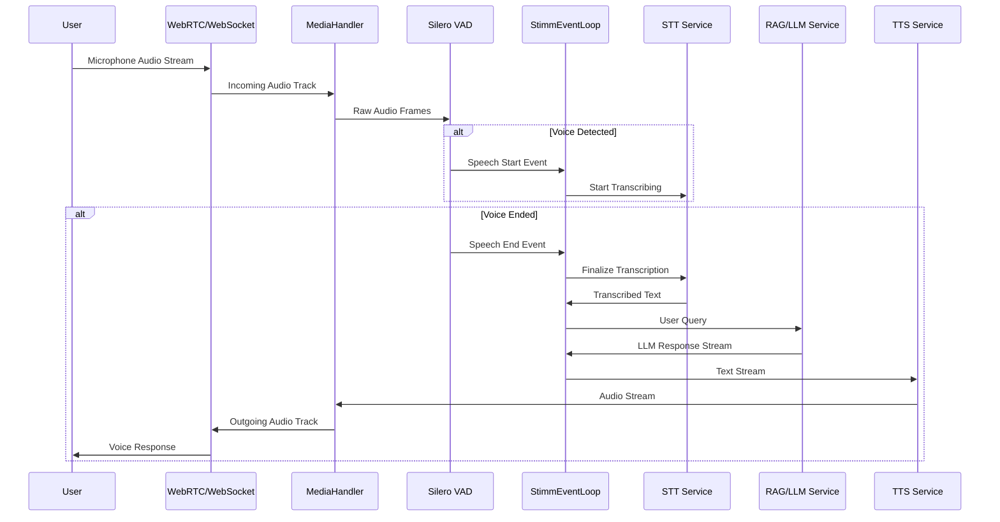

# Data Flow: Audio-to-Audio Pipeline

This page describes the step‑by‑step flow of audio data through the Stimm platform, from microphone input to synthesized voice response.

## High‑Level Sequence

## Step‑by‑Step Explanation

### 1. Ingestion

Audio is captured by the client (browser) and sent via **WebRTC** (preferred) or **WebSocket** to the backend.

- **WebRTC** offers lower latency and better real‑time performance.
- **WebSocket** is used as a fallback when WebRTC is unavailable.

### 2. Media Handling

The `WebRTCMediaHandler` (or `WebSocketMediaHandler`) receives the incoming audio track and buffers the raw audio frames.

- Frames are decoded from the transport format (Opus) to PCM.
- PCM samples are stored in a ring buffer for VAD processing.

### 3. Voice Activity Detection (VAD)

The `SileroVADService` analyzes the audio frames in real‑time to detect speech segments.

- When speech starts, the VAD emits a `speech_start` event.
- When speech ends (after a configurable silence threshold), it emits a `speech_end` event.

### 4. Orchestration

The `StimmEventLoop` acts as the central brain, coordinating all services.

- It subscribes to VAD events and manages the state of the conversation.
- On `speech_end`, it triggers the STT service with the accumulated audio buffer.

### 5. Speech‑to‑Text (STT)

The `STTService` transcribes the audio buffer into text.

- Supports multiple providers (Deepgram, Whisper).
- Returns the transcribed text along with confidence scores and timing information.

### 6. Intelligence (RAG/LLM)

The transcribed text is sent to the `ChatbotService`, which may query **Qdrant** for context (RAG) before sending the prompt to the **LLM**.

- **RAG**: If the agent has a RAG configuration, the system retrieves relevant documents from the vector database and injects them into the prompt.
- **LLM**: The enriched prompt is sent to the configured LLM provider (Groq, Mistral, etc.). The LLM generates a text response, which is streamed back token‑by‑token.

### 7. Text‑to‑Speech (TTS)

The LLM's response is streamed to the `TTSService` which converts text to audio.

- Supports multiple providers (Deepgram, ElevenLabs, etc.).
- Audio is generated in chunks and streamed back to the media handler.

### 8. Output

The generated audio is sent back via WebRTC (or WebSocket) to the user's browser, where it is played through the speakers.

## Latency Considerations

The pipeline is designed for ultra‑low‑latency voice conversations. Key optimizations include:

- **Overlapping processing**: STT starts while the user is still speaking (streaming STT).
- **Parallel RAG retrieval**: Document retrieval happens concurrently with LLM inference.
- **Streaming TTS**: Audio is generated and sent incrementally, reducing time‑to‑first‑byte.
- **Caching**: Frequently accessed embeddings and conversation turns are cached.

## Monitoring and Debugging

Each step emits detailed logs and metrics. You can enable debug logging to see timings, audio frame counts, and provider‑specific details.
