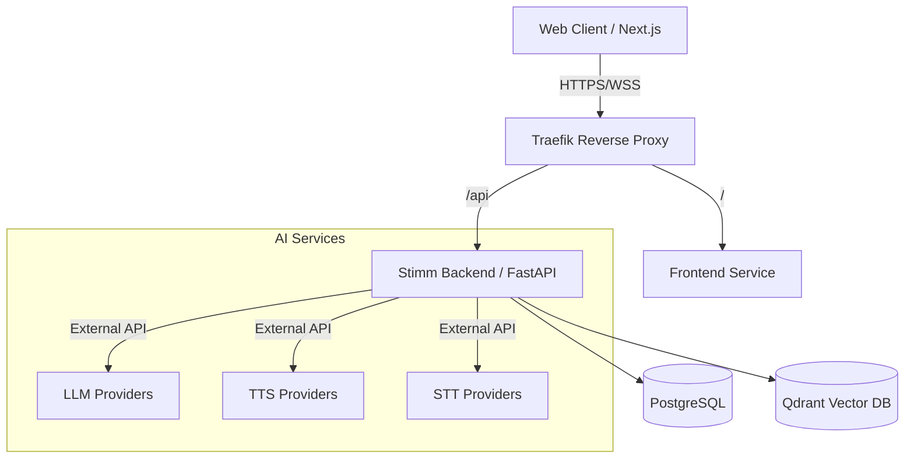

# Architecture Overview

Stimm follows a modular monolith architecture, containerized with Docker Compose. This page provides a high-level overview of the system components and their interactions.

## System Diagram

## Core Components

### 1. Backend (FastAPI)

The backend is a Python FastAPI application that provides:

- **REST API** for managing agents, RAG configurations, and system settings.
- **WebSocket endpoints** for real-time audio streaming and conversation state.
- **Integration with LiveKit** for WebRTC media transport.
- **Orchestration** of AI providers (LLM, TTS, STT) and RAG retrieval.

### 2. Frontend (Next.js)

A modern React-based web application that offers:

- **Dashboard** for managing agents and RAG configurations.
- **Real-time voice interface** for conversing with agents.
- **Admin panels** for system configuration.

### 3. Database Layer

- **PostgreSQL** – Stores persistent data (agents, users, RAG configurations, documents).
- **Qdrant** – Vector database for semantic search and RAG.
- **Redis** – Used for caching, session storage, and SIP bridge state.

### 4. AI Providers

Stimm supports multiple providers for each AI task, allowing you to mix and match based on cost, latency, and quality requirements.

- **LLM**: Groq, Mistral, OpenRouter, local Llama.cpp, OpenAI-compatible.
- **TTS**: Deepgram, ElevenLabs, Async.ai, local Kokoro.
- **STT**: Deepgram, local Whisper.

### 5. Real-time Media (LiveKit)

LiveKit handles WebRTC signaling, media transport, and room management. It enables low-latency, bidirectional audio streaming between clients and the backend.

### 6. SIP Bridge

A telephony integration that connects incoming SIP calls to LiveKit rooms, allowing phone users to interact with AI agents.

## Data Flow

For a detailed step-by-step description of the audio-to-audio pipeline, see [Data Flow](data-flow.md).

## Deployment

The system is designed to be deployed as a set of Docker containers orchestrated by Docker Compose. A Traefik reverse proxy routes external traffic to the appropriate services.

For production deployments, you can replace Traefik with your own ingress controller and scale services independently.

## Next Steps

- [Data Flow](data-flow.md) – Understand the audio processing pipeline.
- [Components](components.md) – Dive deeper into each service and module.
