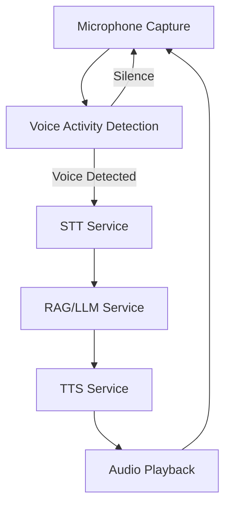

# Voicebot Wrapper Implementation Plan

## Overview
Create a complete voicebot wrapper that integrates STT, RAG/LLM, and TTS modules into a seamless real-time conversation system.

## Architecture



## Technical Components

### 1. Voicebot Wrapper Service (`voicebot_service.py`)
- **Purpose**: Orchestrate the complete voicebot pipeline
- **Key Features**:
  - Real-time audio streaming coordination
  - Voice activity detection integration
  - STT → RAG → TTS pipeline management
  - Conversation state management
  - Error handling and recovery

### 2. Web Audio API VAD Implementation
- **Technology**: Web Audio API + AudioWorklet
- **Features**:
  - Energy-based voice detection
  - Configurable sensitivity thresholds
  - Real-time visual feedback (gray/green button)
  - Ultra-low latency processing (<50ms)

### 3. WebSocket Endpoints
- **Voice Streaming**: `/api/voicebot/stream`
- **Status Updates**: `/api/voicebot/status`
- **Pipeline Control**: `/api/voicebot/control`

### 4. Frontend Interface
- **UI Components**:
  - Voice detection button (gray/green indicator)
  - Real-time transcription display
  - Response visualization
  - Audio playback controls
  - Conversation history

## Implementation Phases

### Phase 1: Microphone Capture & VAD (Current Focus)
- [ ] Create voicebot wrapper service structure
- [ ] Implement Web Audio API microphone capture
- [ ] Add energy-based VAD with configurable thresholds
- [ ] Create visual indicator (gray/green button)
- [ ] Test voice detection accuracy

### Phase 2: STT Integration
- [ ] Integrate existing STT service
- [ ] Create real-time audio streaming to STT
- [ ] Handle interim and final transcripts
- [ ] Add transcription display in UI

### Phase 3: RAG/LLM Integration
- [ ] Connect to existing chatbot service
- [ ] Implement conversation context management
- [ ] Add streaming LLM responses
- [ ] Handle RAG context retrieval

### Phase 4: TTS Integration
- [ ] Integrate existing TTS service
- [ ] Implement streaming audio playback
- [ ] Add audio chunk management
- [ ] Handle playback synchronization

### Phase 5: End-to-End Pipeline
- [ ] Connect all components in sequence
- [ ] Implement conversation state machine
- [ ] Add error handling and recovery
- [ ] Optimize for ultra-low latency

## File Structure
```
src/services/voicebot_wrapper/
├── __init__.py
├── config.py              # Voicebot configuration
├── voicebot_service.py    # Main service orchestrator
├── routes.py              # WebSocket and HTTP routes
├── vad_processor.py       # Voice activity detection
├── static/
│   ├── voicebot.js        # Frontend JavaScript
│   └── audio-processor.js # AudioWorklet for VAD
└── templates/
    └── voicebot.html      # Main interface
```

## Performance Targets
- **Voice Detection Latency**: <50ms
- **STT Processing**: <200ms
- **RAG/LLM Response**: <500ms (first token)
- **TTS Synthesis**: <100ms (first audio chunk)
- **End-to-End Latency**: <1.5 seconds

## Dependencies
- Existing STT service (`services/stt/stt.py`)
- Existing TTS service (`services/tts/tts.py`) 
- Existing RAG service (`services/rag/chatbot_service.py`)
- Web Audio API (browser)
- WebSocket connections

## Testing Strategy
1. **Unit Tests**: Individual component testing
2. **Integration Tests**: Pipeline component testing
3. **End-to-End Tests**: Complete conversation flow
4. **Performance Tests**: Latency and throughput
5. **User Acceptance**: Real-world usage scenarios

## Success Metrics
- Voice detection accuracy >95%
- End-to-end latency <1.5 seconds
- Conversation naturalness and coherence
- System stability and error recovery